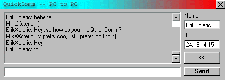



## QuickComm PC \- PC With Comments

### Description

QuickComm PC - PC is a UDP Communications program using the MSWINSCK (Microsoft Winsock) control. With an IP address and a Name, this program allows you to communicate to other users on the fly, without having to set up a connection. Useful for people with cable connections who like to have communications with friends. :) In addition to the simple communications allowed, QuickComm also slides up when not in use, much like an Auto-Hide Taskbar. If incoming data is displayed while hidden, a sound is played, then a small Incoming Message window is displayed at the bottom-right corner of the screen until the user views the incoming text. Download it and check it out. :) If you're looking for help on UDP protocol with Winsock, it's fully commented. If you're just looking for a quick way to talk to someone, it's reliable. Erik Forbes NiftySoft
 
### More Info
 

             |
---                |---
**Submitted On**   |2000-05-02 08:43:54
**By**             |[Garan Singer](https://github.com/Planet-Source-Code/PSCIndex/blob/master/ByAuthor/garan-singer.md)
**Level**          |Advanced
**User Rating**    |4.8 (19 globes from 4 users)
**Compatibility**  |VB 5\.0, VB 6\.0
**Category**       |[Complete Applications](https://github.com/Planet-Source-Code/PSCIndex/blob/master/ByCategory/complete-applications__1-27.md)
**World**          |[Visual Basic](https://github.com/Planet-Source-Code/PSCIndex/blob/master/ByWorld/visual-basic.md)
**Archive File**   |[CODE\_UPLOAD5418522000\.zip](https://github.com/Planet-Source-Code/garan-singer-quickcomm-pc-pc-with-comments__1-7775/archive/master.zip)

